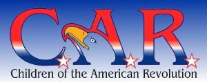
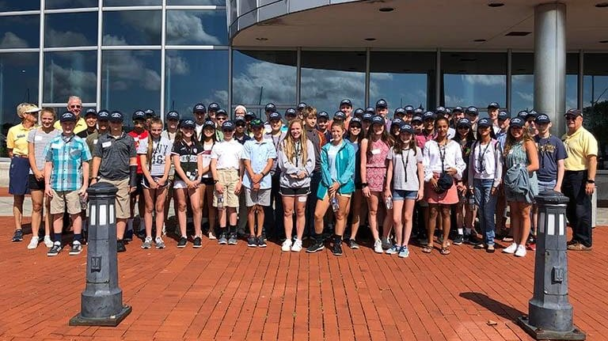
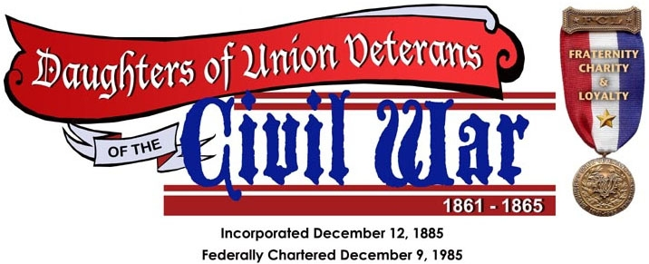
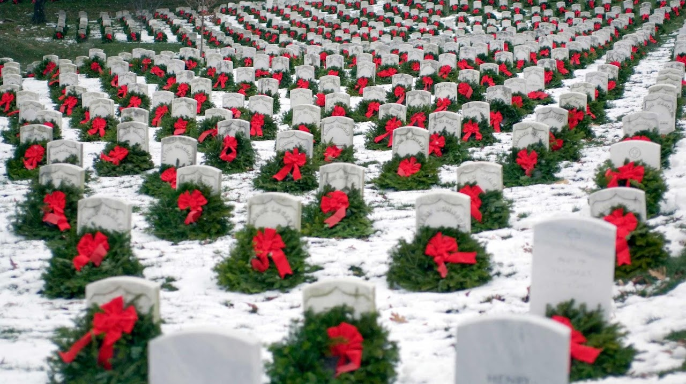
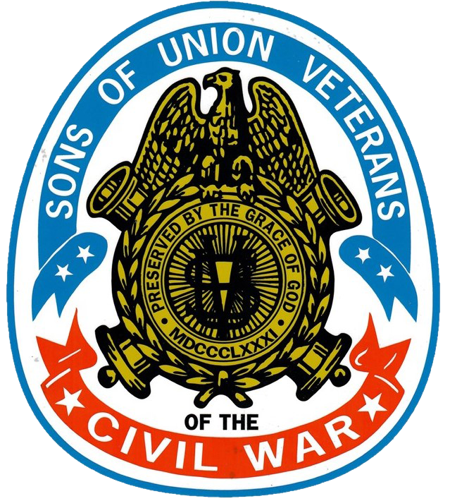
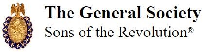
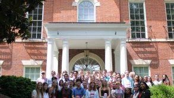
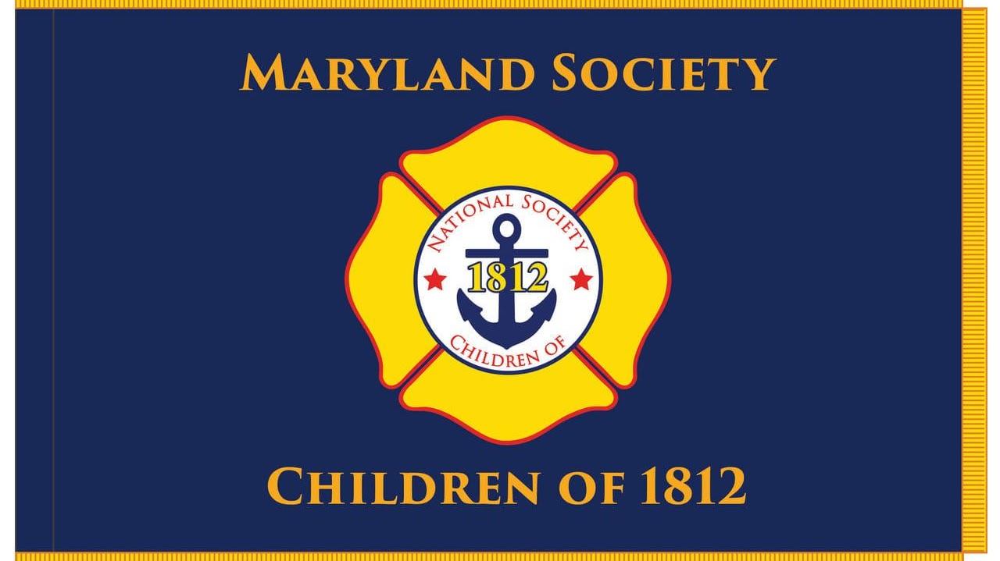

<section class="wrapper bg-light">

<article class="card shadow-lg">

Children of the American Revolution

\"Any boy or girl under the age of twenty-two is eligible for membership
in the National Society of the Children of the American Revolution who
is lineally descended from a man or woman who, with unfailing loyalty,
rendered material aid to the cause of American Independence as a
soldier, sailor, civil officer, or recognized patriot in one of the
several Colonies or States, or of the United States, provided that the
applicant is personally acceptable to the Society.\"   

[**The N.S.C.A.R. Application for
Membership**](https://www.nscar.org/common/Uploaded%20files/nscar_application.pdf)   

Youth Leadership Program

Developing leaders for tomorrow begins today! Give students ages 13-15 a
taste of robust leadership training. Equip them for the future they\'d
like to pursue. Students will spend a half-day in the Student Youth
Leadership Program learning and developing applicable leadership skills
from some of the brightest of today\'s leaders at the [U.S. Naval
Academy](https://navalacademytourism.com/youth-programs-camps).

National History Day

**National History Day®**(NHD) is a non-profit education organization
based in College Park, Maryland. NHD sponsors the National History Day
Contest that encourages **more than half a million** students around the
world to conduct historical research on a topic of their choice.
Students enter these projects at the local and affiliate levels, with
top students advancing to the[ National
Contest](https://www.nhd.org/kenneth-e-behring-national-contest) at the
University of Maryland at College Park. The 2022-2023 theme
is ***Frontiers in History: People, Places, Ideas***. 

Daughters of Union Veterans of the Civil War

Eligibility for membership in the Daughters of Union Veterans of the
Civil War, 1861 -- 1865 is based on the eligibility as formerly required
for membership in the Grand Army of the Republic and shall be limited to
daughters, granddaughters, and great granddaughters of any generation
through lineal descent only.  As stated in our National Constitutions
and Bylaws, this shall never be changed.  The minimum age
for [membership](https://www.duvcw.org/index.php/membership) shall
be **eight years of age**

Wreaths Across America

SUV Junior Membership

Hereditary [membership](https://suvcw.org/governance-forms/membership-application) is
available to a male descendant, 14 years of age (6 to 14 for Juniors),
who meets the following requirements:

1.  You must directly descend from a Soldier, Sailor, Marine or member
    of the Revenue Cutter Service (or directly descend from a brother,
    sister, half-brother, or half-sister of such Soldier, etc.) who was
    regularly mustered and served honorably in, was honorably discharged
    from, or died in the service of, the Army, Navy, Marine Corps or
    Revenue Cutter Service of the United States of America or in such
    state regiments called to active service and was subject to the
    orders of United States general officers, between April 12, 1861 and
    April 9, 1865.

2.  You must never have been convicted of any infamous or heinous crime.

3.  You, or the ancestor through whom membership is claimed, must never
    have voluntarily borne arms against the government of the United
    States.

4.  

{width="4.395833333333333in"
height="1.1145833333333333in"}

Sons of the Revolution

Any male person of good character, and lineal descendant of one who, as
a military, naval or marine officer, soldier, sailor, or marine, in
actual service, under the authority of any of the thirteen Colonies or
States or of the Continental Congress, and remaining always loyal to
such authority, or a lineal descendant of one who signed the Declaration
of Independence, or of one who, as a member of the Continental Congress,
or of the Congress of any of the Colonies or States, or as an official
appointed by or under the authority of any such legislative bodies,
actually assisted in the establishment of American Independence by
services rendered during the War of the Revolution, becoming thereby
liable to conviction of treason against the Government of Great Britain,
but remaining always loyal to the authority of the Colonies or States,
or, who served honorably in a military or naval expedition against the
British during the War of the Revolution under the authority of the
French or Spanish Governments shall be eligible to membership in the
Society. Both Senior and **Junior (the latter under the age of eighteen
years**) [memberships](https://sr1776.org/membership-requirements/) are
available.

{width="3.0520833333333335in"
height="1.71875in"}

[Congressional Seminar Essay Contest for High School
Students](https://nscda.org/student-resources/congressional-essay-contest/)

The Congressional Essay Contest is run by NSCDA Corporate Societies and
Town Committees across the United States. Freshman, sophomore, junior,
or senior year high school students submit essays that are then judged
and awarded. The essay topic changes annually. 

[Job's Daughters
International ](https://jobsdaughtersinternational.org/join/)

Job's Daughters International is where shy girls turn into confident
young women. Our members grow alongside their peers and find their voice
in a safe and supportive environment. The girls lead themselves and plan
their own activities, learning teamwork and problem solving along the
way

[Maryland Society Children of
1812](https://www.facebook.com/MDChildren1812/)

</article>

</section>
