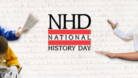

<section class="wrapper bg-light">

<article class="card shadow-lg">

{width="3.0520833333333335in"
height="1.71875in"}

[Congressional Seminar Essay Contest for High School
Students](https://nscda.org/student-resources/congressional-essay-contest/)

The Congressional Essay Contest is run by NSCDA Corporate Societies and
Town Committees across the United States. Freshman, sophomore, junior,
or senior year high school students submit essays that are then judged
and awarded. The essay topic changes annually. 

Youth Leadership Program

Developing leaders for tomorrow begins today! Give students ages 13-15 a
taste of robust leadership training. Equip them for the future they\'d
like to pursue. Students will spend a half-day in the Student Youth
Leadership Program learning and developing applicable leadership skills
from some of the brightest of today\'s leaders at the [U.S. Naval
Academy](https://navalacademytourism.com/youth-programs-camps).

National History Day

**National History Day®**(NHD) is a non-profit education organization
based in College Park, Maryland. NHD sponsors the National History Day
Contest that encourages **more than half a million** students around the
world to conduct historical research on a topic of their choice.
Students enter these projects at the local and affiliate levels, with
top students advancing to the[ National
Contest](https://www.nhd.org/kenneth-e-behring-national-contest) at the
University of Maryland at College Park. The 2022-2023 theme
is ***Frontiers in History: People, Places, Ideas***. 

</article>

</section>
