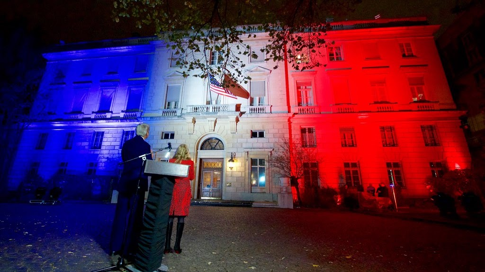
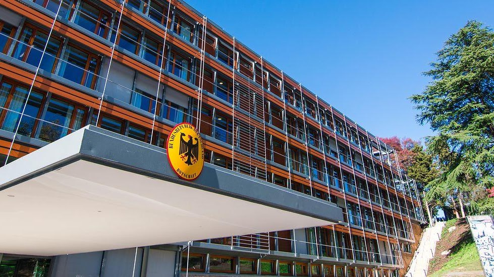

<section class="wrapper bg-light">

<article class="card shadow-lg">

{width="6.708333333333333in"
height="3.7668864829396327in"}

[Internships at the Embassy of
France](https://franceintheus.org/spip.php?article1670)

Only Students from a local school/university, whatever the nationality
(including French) or those candidates studying within an American
institution, can [**apply to one of the open
positions**](https://fr.franceintheus.org/spip.php?rubrique218). The
procedure for students in France is different (please see below).

The Press and Communication Office **accepts interns adherent to the
fall, spring and summer semester schedule**.** Interns must be currently
enrolled, full-time students in an American university** to be
considered. **A proficiency in French and native speaking/ writing level
in English is required**.

German Embassy 

The embassy is the official representation of the Federal Government of
Germany in the United States. Our Visa, Passport and Legal Section
provides services for US residents and German citizens within the
Embassy\'s area of consular jurisdiction: Delaware, Maryland, Virginia,
West Virginia and the District of Columbia. 

{width="4.791666666666667in"
height="1.1666666666666667in"}

[Academic
internships](https://www.eda.admin.ch/countries/usa/en/home/news/vacancies/academic-internships.html)

The Embassy of Switzerland is looking for motivated candidates for
internships covering many departments and aspects of the work of the
Embassy of Switzerland in Washington, D.C.

The Consulate General in New York offers 3 internship positions to
qualified candidates in the following sections:

1.  Economic Affairs and Communication

2.  Culture and Education

3.  Swiss Business Hub in San Francisco

The purpose of these academic internships is to offer students or recent
graduates an opportunity to discover the activities of a Swiss
representation abroad and to become familiar with the diverse aspects of
a diplomatic career. All positions are full-time (40 hours per week) and
run for 6 months. Remuneration for the positions is USD 3,400 per month.
For details and how to apply, read the document on internships.

[Internships (PDF, 3 Pages, 665.3 kB,
English)](https://www.eda.admin.ch/content/dam/mission-new-york/en/documents/Internships_at_SCGNY_ENG.pdf)

</article>

</section>
