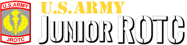
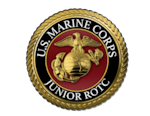
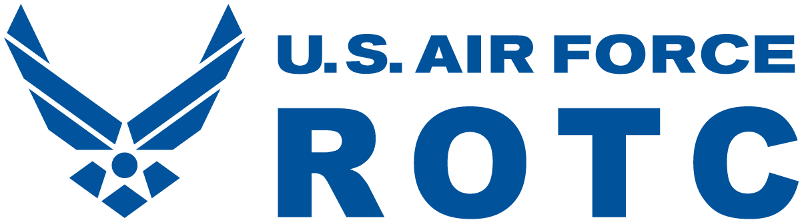
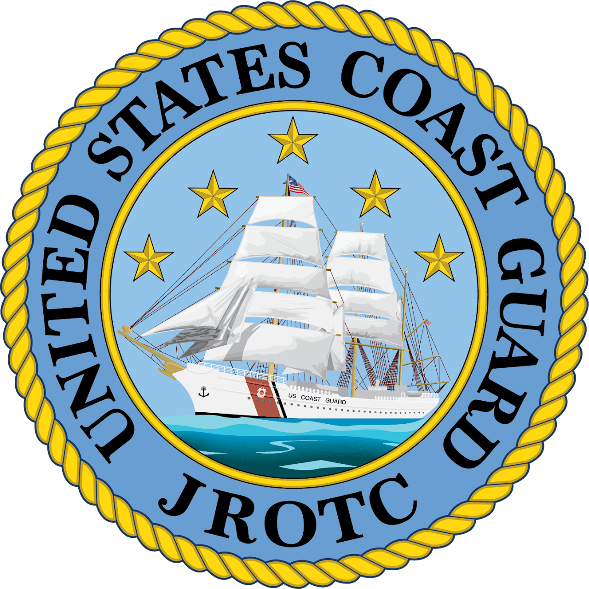

<section class="wrapper bg-light">

<article class="card shadow-lg">

Training the next generation of the **Prosterity** is a Top Priority!

{width="3.8645833333333335in"
height="0.7083333333333334in"}

Sea Cadets

[Sea Cadets](https://www.seacadets.org/who-we-are/) are young men and
women** aged 10 through the end of high school** who choose adventure,
seek challenges, and step outside of their comfort zones. There are two
programs within Sea Cadets.  

The Navy League Cadet Corps (NLCC) is for middle school students** aged
10 to 13**. 

The Naval Sea Cadet Corps (NSCC) is for** ages 13 through the end of
high school**.

{width="6.947916666666667in"
height="1.0416666666666667in"}

Navy Junior Officer Training

The [NJROTC](https://www.netc.navy.mil/NSTC/NJROTC/) program was
established by Public Law in 1964 and may be found in Title 10, U.S.
Code, Chapter 102. The program is conducted at accredited secondary
schools throughout the nation, by instructors who are retired Navy,
Marine Corps, and Coast Guard officers and enlisted personnel. The
NJROTC curriculum emphasizes citizenship and leadership development, as
well as our maritime heritage, the significance of sea power, and naval
topics such as the fundamentals of naval operations, seamanship,
navigation and meteorology. Classroom instruction is augmented
throughout the year by community service activities, drill competition,
field meets, flights, visits to naval activities, marksmanship training,
and other military training. Uniforms, textbooks, training aids, travel
allowance, and a substantial portion of instructors\' salaries are
provided by the Navy.

Be enrolled in and attending a regular course of instruction in a grade
9 through 12 at the school hosting the unit.

Army JROTC

[U.S. Army Reserve Officers' Training
Corps](https://www.usarmyjrotc.com/scholarship-opportunities/) (ROTC)
scholarships provide full financial assistance for college tuition and
mandatory education fees (or room and board).  Additionally, scholarship
winners receive tax free subsistence allowance for up to 10 months a
year at a rate of \$420.00 per month and \$1200 annually for textbooks,
classroom supplies, and equipment. Must have a GPA 2.5 High School Age
**17-26**

Marine JROTC

Congress established the Junior ROTC under the National Defense Act of
1916. Certain requirements as stipulated by Congress under U.S. Code:
Title 10, Section 2031 must be satisfied in order to participate in a
JROTC program. The criteria for determining eligibility to participate
in [MCJROTC](https://www.mcjrotc.marines.mil/Students/Join-a-Unit/) are:

1\. High school enrollment

2\. Citizenship

3\. Physical fitness

{width="6.760416666666667in"
height="1.883218503937008in"}

Air Force ROTC

After completing all [Air Force
ROTC](https://www.afrotc.com/what-it-takes/) and academic degree
requirements, cadets accept a commission as second lieutenants in the
Air Force or Space Force, appointed by the President of the United
States.

{width="7.229166666666667in"
height="7.229166666666667in"}

Coast Guard JROTC

The Coast Guard established its
first[ JROTC](https://www.uscg.mil/Community/JROTC/) unit in 1992, in
Miami, FL. Under recent federal legislation, the Coast Guard is
expanding the JROTC program to every Coast Guard District by 2025.

Per 10 USC Chapter 102, the flagship purpose of JROTC is "to instill in
students in United States secondary educational institutions the values
of citizenship, service to the United States, and personal
responsibility and a sense of accomplishment."

In light of this, the mission of Coast Guard JROTC is: Developing
Service-Minded Citizens of Character. To accomplish the mission, the
program develops cadets on the COAST:

{width="2.3958333333333335in"
height="0.6666666666666666in"}

Law Enforcement Cadet 

The program is available to male and female high school students who
have completed their junior year of high school and are in good academic
standing. They should be of good moral character and possess a desire to
learn more about the law enforcement profession. Their high school
should recommend students who meet these qualifications to local posts
who are sponsoring the [Junior Law Cadet
Program.](https://www.legion.org/juniorlaw/about)

</article>

</section>
