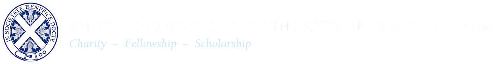
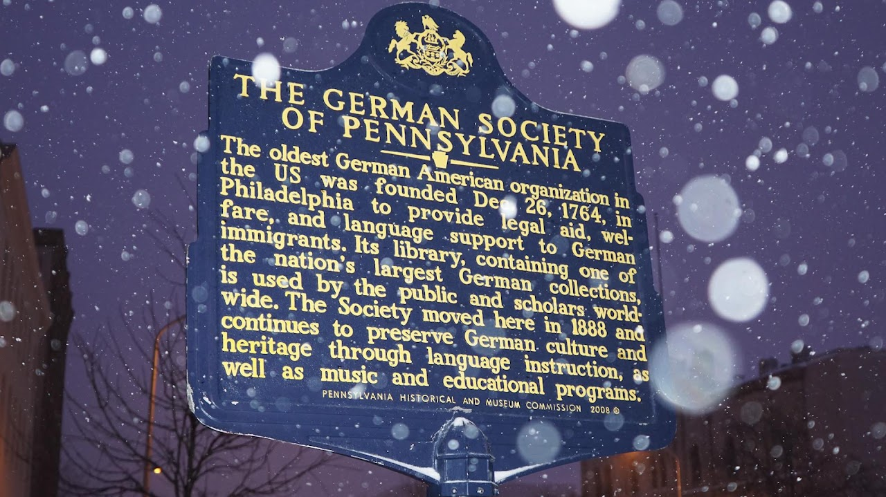
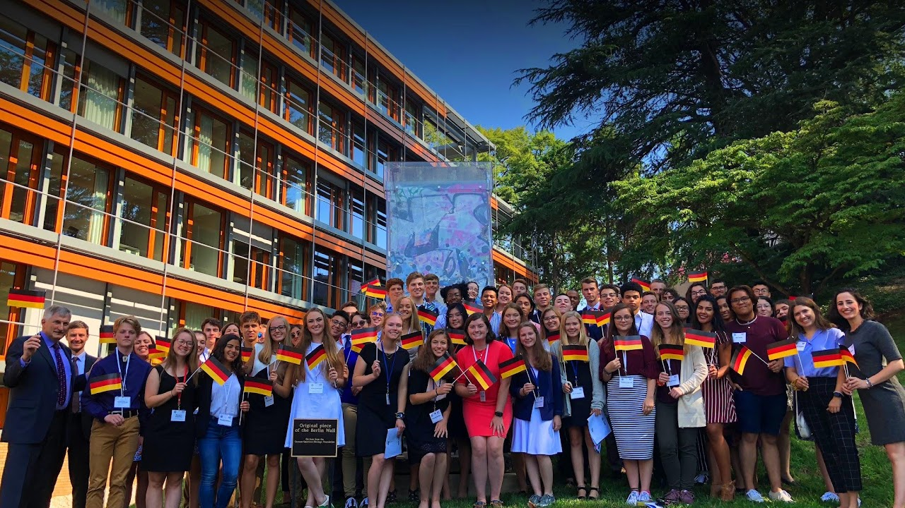
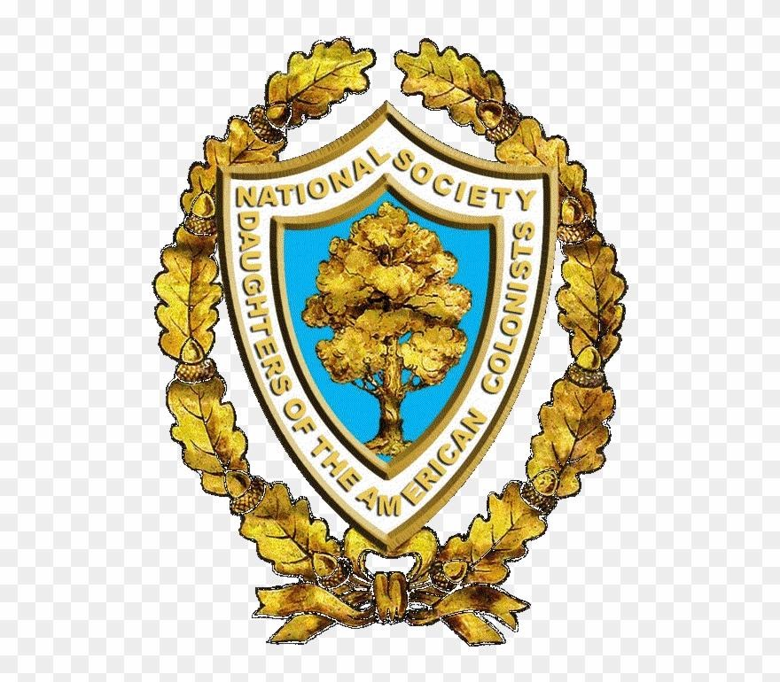
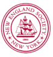

<section class="wrapper bg-light">

<article class="card shadow-lg">

[Macmillan Scholarship](https://standrewsny.org/page/Scholarship)

The Agnes and Margaret Macmillan Scholarship is made possible through a
grant from the estate of the Society's first female member, Margaret
'Peggy Macmillan'. In 2006, Peggy began support of the Scholarship Fund
through annual donations made in the memory of her departed sister
Agnes. In the ensuing years, Peggy contributed significantly to the fund
to establish the Macmillan - St. Andrew\'s Society Scholarship. Sadly,
she passed away in April 2013. In her continued generosity, Peggy
thoughtfully remembered the Society in her estate planning; guaranteeing
The Macmillan Scholarship in perpetuity. It is now aptly renamed The
Agnes and Margaret Macmillan-St. Andrew\'s Society Scholarship.

{width="3.4270833333333335in"
height="1.2395833333333333in"}

[Lillian and Arthur Dunn
Scholarship](https://www.dar.org/national-society/scholarships/scholarships)

The Lillian and Arthur Dunn Scholarship is a \$2,500 scholarship awarded
for up to four years to two well-qualified, deserving sons and daughters
of members of the NSDAR for four years of college. Renewal is
conditional upon maintenance of a GPA of 3.25.  Outstanding recipients
pursuing graduate study may reapply each year for an additional period
of up to four years of study.  The DAR member number of the mother, who
is a current-dues paying member, must be included with the application.

**Questions? Contact the National Vice Chairman for the Lillian and
Arthur Dunn Scholarship: LillianArthurDunnScholarship@NSDAR.org**

{width="3.4270833333333335in"
height="1.2395833333333333in"}

[Dr. Aura-Lee A. and James Hobbs Pittenger  American
History](https://www.dar.org/national-society/scholarships/history-etc)

The Dr. Aura-Lee A. and James Hobbs Pittenger American History
Scholarship is awarded to graduating high school students who will
pursue an undergraduate degree with a concentrated study of a minimum of
24 credit hours in American History and American Government. Renewal is
conditional upon maintenance of a GPA of 3.25.  This scholarship is
renewable. This award is intended to promote the study of our country\'s
history among our finest students. U.S. Citizens residing abroad may
apply through a Units Overseas Chapter.

The Dr. Aura-Lee A. and James Hobbs Pittenger American History
Scholarship is an award of \$2,000 each year for up to four years with
annual transcript review by the National Chairman required for renewal.

**Questions? Contact the National Vice Chairman for the Dr. Aura-Lee and
James Hobbs Pittenger
Scholarship: PittengerAmerHistoryScholarship@NSDAR.org**

{width="3.4270833333333335in"
height="1.2395833333333333in"}

[DAR
Centennial](https://www.dar.org/national-society/scholarships/history-etc)

The DAR Centennial Scholarship is awarded to two outstanding students
pursuing a course of graduate study in the field of historic
preservation at a college or university in the United States.  This
scholarship was established from a portion of the proceeds from the sale
of the Centennial Pin. This is a one-time award in the amount of
\$2,500.

**Questions? Contact the National Vice Chairman for the DAR Centennial
Scholarship: DARCentennialScholarship@NSDAR.org**

{width="3.4270833333333335in"
height="1.2395833333333333in"}

[Lucinda Beneventi Findley
History](https://www.dar.org/national-society/scholarships/history-etc)

A one-time \$2,000 scholarship awarded to two graduating high school
seniors that have demonstrated advance interest in history and are
planning to major in or pursue the study of history in a full-time
accredited college or university in the United States.  The applicant
must have a GPA of 3.25. 

**Questions? Contact the National Vice Chairman for the Lucinda
Beneventi Findley History
Scholarship: LBFindleyHistoryScholarship@NSDAR.org**

{width="3.4270833333333335in"
height="1.2395833333333333in"}

[Dr. Francis Anthony Beneventi
Medical](https://www.dar.org/national-society/scholarships/nursing-medical-scholarships)

A preferred amount \$5,000 scholarship awarded to one student either
attending or planning to attend an approved, accredited medical school,
college, or university. The applicant must have a minimum GPA of 3.25.
This scholarship is not automatically renewable; however, recipients may
reapply for consideration each year for up to four consecutive years,
pending receipt of proof of continued enrollment (no pre--med,
veterinarian, or physician assistant), and after the first semester, an
annual transcript review indicating a minimum GPA of 3.25.

**Questions? Contact the National Vice Chairman for the Dr. Francis
Anthony Beneventi Medical
Scholarship: DrFABeneventiScholarship@NSDAR.org**

{width="3.4270833333333335in"
height="1.2395833333333333in"}

[Irene and Daisy MacGregor
Memorial](https://www.dar.org/national-society/scholarships/nursing-medical-scholarships)

The Irene and Daisy MacGregor Memorial Scholarship is awarded to two
students of high scholastic standing and character who have been
accepted into or are pursuing an approved course of study to become a
medical doctor (no pre-med, veterinarian or physician assistant) at an
approved, accredited medical school. Renewal is conditional upon
maintenance of a GPA of 3.25.

This scholarship is also available to students who have been accepted
into or who are pursuing an approved course of study in the field of
psychiatric nursing at the graduate level at accredited medical schools,
colleges, or universities. There is a preference to females \"if equally
qualified.\"

**Questions? Contact the National Vice Chairman for the Irene and Daisy
MacGregor Memorial Scholarship: MacGregorScholarship@NSDAR.org**

{width="3.4270833333333335in"
height="1.2395833333333333in"}

[Leslie Andree Hanna
Medical](https://www.dar.org/national-society/scholarships/nursing-medical-scholarships)

A one-time preferred amount of \$5,000 to a deserving female student who
is a US citizen attending medical school. The selection process is based
on academic merit with a minimum GPA of 3.25 on a 4.0 scale or the
equivalent GPA on the scale used by the applicable educational
institution. The recipient may reapply for the scholarship each year,
but is not guaranteed the award.

**Questions? Contact the National Vice Chairman for the Leslie Andee
Hanna Medical Scholarship: LAHannaMedicalScholarship@NSDAR.org**

{width="3.4270833333333335in"
height="1.2395833333333333in"}

[Alice W.
Rooke](https://www.dar.org/national-society/scholarships/nursing-medical-scholarships)

A \$5,000 scholarship awarded to one student who has been accepted into
or who are pursuing an approved course of study to become a medical
doctor (no pre--med, veterinarian, or physician assistant) at approved,
accredited medical schools, colleges, and universities. The scholarship
is not automatically renewable; however, applicant may reapply for up to
four years.

**Questions? Contact the National Vice Chairman for the Alice W. Rooke
Medical Scholarship: AliceWRookeScholarship@NSDAR.org**

{width="3.4270833333333335in"
height="1.2395833333333333in"}

[Caroline E. Holt
Nursing](https://www.dar.org/national-society/scholarships/nursing-medical-scholarships)

A one-time \$2,500 award is given to three students who are in financial
need and who have been accepted or is currently enrolled in an
accredited school of nursing. A letter of acceptance into a nursing
program or a transcript stating the applicant is in a nursing program
must be included with the application. 

**Questions? Contact the National Vice Chairman for the Caroline E. Holt
Nursing Scholarship: CarolineEHoltScholarship@NSDAR.org**

{width="3.4270833333333335in"
height="1.2395833333333333in"}

[DAR--Lena
Ferguson](https://www.dar.org/national-society/scholarships/nursing-medical-scholarships)

A one-time \$5,000 award given annually to two students who graduated
from a District of Columbia Public School or Public Charter School who
have been accepted or are currently enrolled in a two-year,
undergraduate or graduate degree nursing program at the University of
the District of Columbia.  A minimum GPA of 3.00 on a 4.0 scale or the
equivalent GPA on the scale used by the institution is required. This
scholarship is administered by the University of the District of
Columbia and UDC students can find more information about applying at
their [Scholarship Universe online
portal](https://www.udc.edu/enrollment-management/scholarships/)   

**Questions? Contact the National Vice Chairman for the DAR--Lena
Ferguson Scholarship: DCScholarship@NSDAR.org** 

{width="3.4270833333333335in"
height="1.2395833333333333in"}

[Occupational/Physical
Therapy](https://www.dar.org/national-society/scholarships/nursing-medical-scholarships)

The Occupational/Physical Therapy Scholarship, in the amount of \$2,000,
is awarded to two students  who are in financial need and have been
accepted or are attending an accredited school of occupational therapy
(including art, music, or physical therapy).

**Questions? Contact the National Vice Chairman for the
Occupational/Physical Therapy
Scholarship: OccupationalPhysicalTherapyScholarship@NSDAR.org** 

{width="3.4270833333333335in"
height="1.2395833333333333in"}

[Edward G. and Helen A. Borgens Elementary
Teacher](https://www.dar.org/national-society/scholarships/scholarships-0)

The Edward G. and Helen A. Borgens Elementary Teacher Scholarship is a
one-time preferred amount of up to \$1,500 awarded to one student who is
twenty-five (25) years of age or older. Applicants must be studying to
teach at the elementary school level.  Applicants must have at least a
3.5 GPA, be at least a college sophomore, and attend or plan on
attending an accredited college or university.  The award is based on
academic merit and is not automatically renewable, however, recipients
may reapply for consideration as long as they meet the eligibility
requirements.

**Questions? Contact the National Vice Chairman for the Edward G. and
Helen A. Borgens Elementary Teacher
Scholarship: BorgensElementaryScholarship@NSDAR.org** 

{width="3.4270833333333335in"
height="1.2395833333333333in"}

[Edward G. and Helen A. Borgens Secondary
Teacher](https://www.dar.org/national-society/scholarships/scholarships-0)

The Edward G. and Helen A. Borgens Secondary Teacher Scholarship is a
one-time preferred amount of up to \$1,500 awarded to one student who is
twenty-five (25) years of age or older. Applicants must be studying to
teach at the secondary school level.  Applicants must have at least a
3.5 GPA, be at least a college sophomore, and attend or plan on
attending an accredited college or university.  The award is based on
academic merit and is not automatically renewable, however, recipients
may reapply for consideration as long as they meet the eligibility
requirements.

**Questions? Contact the National Vice Chairman for the Edward G. and
Helen A. Borgens Secondary Teacher
Scholarship: BorgensSecondaryEducationScholarship@NSDAR.org**

{width="3.4270833333333335in"
height="1.2395833333333333in"}

[Arthur Lockwood Beneventi
Law](https://www.dar.org/national-society/scholarships/scholarships-1)

The Arthur Lockwood Beneventi Law Scholarship is a one-time preferred
amount \$2,000 scholarship awarded to a student who is either enrolled
in or attends an accredited law school and has a minimum GPA of 3.25.
The scholarship is not automatically renewable; however, recipients may
reapply for consideration each year.

**Questions? Contact the National Vice Chairman for the Arthur Lockwood
Beneventi Scholarship: ALBeneventiLawScholarship@NSDAR.org**

{width="3.4270833333333335in"
height="1.2395833333333333in"}

[Mary Elizabeth Lockwood Beneventi
MBA](https://www.dar.org/national-society/scholarships/scholarships-1)

The Mary Elizabeth Lockwood Beneventi MBA Scholarship is a one-time
preferred amount \$2,000 scholarship for a student attending graduate
school full time in an accredited college or university and majoring in
business administration. The applicant must have a minimum GPA of 3.25.
The scholarship is not automatically renewable, however, recipients may
reapply for consideration each year.

**Questions? Contact the National Vice Chairman for the Mary Elizabeth
Lockwood Beneventi MBA
Scholarship: MELBeneventiMBAScholarship@NSDAR.org**

{width="3.4270833333333335in"
height="1.2395833333333333in"}

[Margaret Howard
Hamilton](https://www.dar.org/national-society/scholarships/scholarships-1)

The Margaret Howard Hamilton Scholarship is awarded to a graduating high
school senior who has been accepted into the Harvey and Bernice Jones
Learning Center, housing the Ben Caudle Learning Program at the
University of the Ozarks, Clarksville, Arkansas. Applications must be
requested directly through the Learning Center upon acceptance into this
program for learning disabled students. This award is \$1,000 annually
for up to four years with annual transcript review by the National
Chairman required for renewal.

[Margaret Howard Hamilton Scholarship
Checklist](https://www.dar.org/sites/default/files/members/darnet/forms/DAR%20Scholarship%20Application%20Checklist.MHHamilton%28October%202022%29.pdf)

[Margaret Howard Hamilton Scholarship Application Cover
Sheet](https://www.dar.org/sites/default/files/members/darnet/forms/Margaret%20Howard%20Hamilton%20Scholarship%20Cover%20Sheet.pdf)

**Questions? Contact the National Vice Chairman for the Margaret Howard
Hamilton Scholarship: MHHamiltonScholarship@NSDAR.org**

{width="3.4270833333333335in"
height="1.2395833333333333in"}

[Robert Hunter Swadley
Horticulture](https://www.dar.org/national-society/scholarships/scholarships-1)

The Robert Hunter Swadley Horticulture Scholarship is for graduating
high school seniors with a minimum 3.0 GPA on 4.0 scale who will be
entering an accredited college or university located in the United
States as a freshman with a major in horticulture.  The applicant must
be a United States citizen residing in the state of California.  The
scholarship shall cover full or partial tuition funding for room and
board, books and educational supplies.  The actual amount of the
scholarship will be determined each year based on the income generated
by the principal of the fund.

**Questions? Contact the National Vice Chairman for the Robert Hunter
Swadley Horticulture
Scholarship: RobertHunterSwadleyHortScholarship@NSDAR.org**

{width="3.4270833333333335in"
height="1.2395833333333333in"}

[Nellie Love Butcher
Music](https://www.dar.org/national-society/scholarships/scholarships-1)

The Nellie Love Butcher Music Scholarship is a one-time preferred amount
of up to \$5,000 awarded annually to a male and female music student who
is pursuing an education in piano or voice. Special consideration shall
be given to students currently attending the Duke Ellington School of
the Performing Arts in Washington, D.C. Performance material on a mp3
file must be submitted with the application.  The scholarship is for one
year, and is not automatically renewable; however, recipients may
reapply for consideration each year, for four based on maintaining a
minimum of a 3.0 GPA. [Click
here](https://www.dar.org/sites/default/files/members/committees/Nellie%20Love%20Butcher%20Music%20Scholarship%20MP3%20Instructions.docx) for
mp3 file submission instructions. 

**Questions? Contact the National Vice Chairman for the Nellie Love
Butcher Music Scholarship: NLButcherMusicScholarship@NSDAR.org**

{width="3.4270833333333335in"
height="1.2395833333333333in"}

[William Robert Findley Graduate
Chemistry](https://www.dar.org/national-society/scholarships/scholarships-1)

The William Robert Findley Graduate Chemistry Scholarship is a one-time
preferred amount \$2,000 scholarship for a student attending graduate
school full time in an accredited college or university and majoring in
chemistry. The applicant must have a minimum GPA of 3.25. The
scholarship is not automatically renewable, however, recipients may
reapply for consideration each year.

**Questions? Contact the National Vice Chairman for the William Robert
Findley Graduate Chemistry
Scholarship: WRFindleyChemistryScholarship@NSDAR.org**

{width="3.4270833333333335in"
height="1.2395833333333333in"}

[Leo W. and Alberta V. Thomas
Utz](https://www.dar.org/national-society/scholarships/scholarships-1)

The Leo W. and Alberta V. Thomas Utz Scholarship -- English is a
scholarship in the amount of \$4,000 year for up to four consecutive
years to students who are pursing undergraduate or graduate degrees in
English. Renewal is conditional upon maintenance of a GPA of 3.25 based
on a 4.0 scale used by the educational institution.  An official
transcript must be submitted to the Office of the Reporter General each
year by July 10**^th^** or the scholarship is forfeited.

**Questions? Contact the National Vice Chairman for the Leo W. and
Alberta V. Thomas Utz Scholarship -- English
Scholarship: UtzEnglishScholarship@NSDAR.org**

{width="4.166666666666667in"
height="1.3958333333333333in"}

[St. Andrew's Society of
Philadelphia](https://standrewsociety.org/about-the-program/)

The Scholarship program of the St. Andrew's Society of Philadelphia is
designed to foster better understanding and relations between the United
States and Scotland through the exchange of the best and brightest
university students from our respective countries. Each year, the
Society provides funds to send a small group of American students to
attend a full year at one of the "Four Ancients": the Universities of
Aberdeen, Edinburgh, Glasgow, and St. Andrew's. These U.S. scholars are
chosen from a pool of applicants nominated by 30 participating colleges
and universities in the Philadelphia region.  In return, the
Universities of Aberdeen and St. Andrew's each select a Scottish student
to spend a year at Drexel University and the University of Pennsylvania,
respectively. The current amount of each scholarship is \$35,000. This
amount increases from time to time as our funds and circumstances allow.

[German Society of
Pennsylania](https://www.germansociety.org/scholarships/)

We are pleased to announce the opening of the application process of the
German Society's Scholarship Program for the upcoming academic year. The
scholarship award is intended to provide financial assistance to
selected undergraduate students studying German language and literature.
Awards are based primarily on the student's achievement and promise,
although financial need may also be considered.  Typical awards in
recent years have been \$2,000 to \$5,000, with the dollar amount and
number of recipients varying from year to year. The awards may be
applied only to tuition, are paid in two installments at the beginnings
of the fall and spring semesters, and are transmitted directly to the
recipient's college or university upon certification of enrollment by
that institution. Students are expected to enroll in at least one German
course during each semester for which they receive support.

[**Click here to download a 2023/2024 Scholarship Application
Form**](https://www.germansociety.org/wp-content/uploads/2023/01/ApplicationForm2023.pdf) 

[Congress-Bundestag Youth Exchange
(CBYX)](https://usagermanyscholarship.org/)

The Congress-Bundestag Youth Exchange (CBYX) scholarship is for
motivated high school students who want to experience a culture and
learn a language through a full immersion experience. Learn about German
culture first-hand by living with a host family and attending a German
high school. Embark on an adventure that is unlike any other. The CBYX
program additionally offers vocational and young professional
scholarship opportunities; visit the [Programs page to learn
more](https://usagermanyscholarship.org/cbyx-programs/). 

[Jamestowne Society
Fellowship](https://www.jamestowne.org/research-fellowship.html)

The Jamestowne Society offers an Annual Fellowship to support completion
of a graduate thesis or essay on the history and culture of Virginia
before 1700.  Applicants may be candidates for graduate degrees in any
relevant discipline such as History, American Studies, Literature,
Archaeology, Anthropology, Fine Arts, etc., if their research is devoted
either exclusively or very substantially to Colonial Virginia prior to
1700.  The Fellowship amount awarded is determined by the project, and
applicant proposal.  The amount will not exceed \$10,000

[National
Awards](https://nsdac.org/work-of-the-society/patriotic/national-awards/)

The National Awards Committee has a fascinating history of more than
fifty years as a vital activity of the National Society Daughters of the
American Colonists. Medals of Award may be presented by state societies
and chapters on college and high school campuses for proficiency in
academic subjects, ROTC activities, and Good Citizenship. Through this
committee, the National Society sponsors awards presented to honor
graduates at the military academies and special training facilities of
the United States of America.   These awards are financed with generous
contributions from state societies, chapters, and individual members.
The committee presents the listed National Awards below annually:

{width="0.9166666666666666in"
height="0.9791666666666666in"}

[NES Scholarship Program](https://nesnyc.org/scholarship-program/)

The New England Society in the City of New York (NES) awards
scholarships each year to deserving New York City high school students
who will be attending a college or university in New England. **To
qualify for consideration, the candidate must:**

- **be an incoming freshman to an eligible New England college or
  university as described below **(in the states of Connecticut, Maine,
  Massachusetts, New Hampshire, Rhode Island, or Vermont),

- **live and attend high school in one of the five boroughs of New York
  City, and**

- **have a demonstrated need of financial aid.**

Eligible Institutions

New England Society scholarships are sent directly to the recipient's
college or university to be utilized solely for the benefit of the
student to reduce his or her financial burden. NES scholarships cannot
be used to displace other grants or aid packages awarded by the
institution. They are only available to supplement, not displace, grants
from the college and university. For this reason, applications will not
be considered from students who will be attending schools with financial
aid policies under which they meet full demonstrated financial need
without using loans (i.e., "no loan" schools). It is the responsibility
of each student to become thoroughly familiar with the policies and
guidelines of their institution. Questions relating to eligible
institutions should be directed to the NES office.

</article>

</section>
