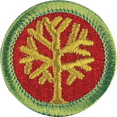
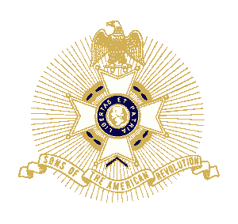
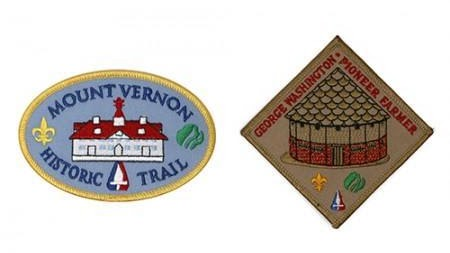
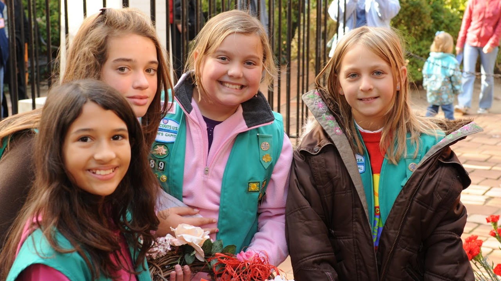
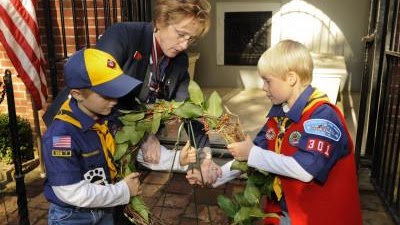

<section class="wrapper bg-light">

<article class="card shadow-lg">

Training the next generation of the **Prosterity** is a Top Priority!

Genealogy Merit Badge

[Genealogy](https://www.scouting.org/merit-badges/genealogy/)  Exploring
your roots---where your family name came from, why your family lives
where it does, what your parents and grandparents did for fun when they
were your age---can be fascinating. Discovering your ancestors back
through history is what genealogy is all about.

[ARTHUR M. AND BERDENA KING EAGLE SCOUT SCHOLARSHIP
CONTEST](https://dcssar.org/page-18127)

Open to all Eagle Scouts who are currently registered in an active unit
and have not reached their 19th birthday during the year of
application.  he application consists of three parts:

1.  [Eagle Scout
    Application](https://dcssar.org/resources/Documents/Eagle-Scout-Application.doc)

2.  [Eagle Scout Ancestor
    Chart](https://dcssar.org/resources/Documents/Eagle-Scout-Ancestor-2014-02-03-2.pdf)

3.  500 word Patriotic Themed Essay

[Mount Vernon Scouting
Booklet](https://www.mountvernon.org/plan-your-visit/group-reservations/student-groups/boys-girls-scouts/)

This guide takes scouts on a scavenger hunt around the estate while
learning about George Washington. Completion of the route included in
the booklet will earn scouts the Mount Vernon Historic Trail patch and
the George Washington: Farmer patch.

[DOWNLOAD SCOUTING
BOOKLET](https://mtv-main-assets.s3.amazonaws.com/files/resources/scavenger-hunt_spreads.pdf)

 

[Brownie and Girl Scout Badge
Activities](https://www.mountvernon.org/plan-your-visit/group-reservations/student-groups/boys-girls-scouts/)

These Mount Vernon related activities can help your Brownie or Girl
Scout earn badges at their grade level. 

[DOWNLOAD SCOUTING
BOOKLET](https://mtv-main-assets.s3.amazonaws.com/files/resources/scavenger-hunt_spreads.pdf)

[Scouts BSA Badge
Activities](https://www.mountvernon.org/plan-your-visit/group-reservations/student-groups/boys-girls-scouts/)

These Mount Vernon-related activities can help scouts earn merit badges
at their grade level.

[DOWNLOAD SCOUTING
BOOKLET](https://mtv-main-assets.s3.amazonaws.com/files/resources/scavenger-hunt_spreads.pdf)

{width="3.4270833333333335in"
height="1.2395833333333333in"}

[My Family Story
(Brownie) ](https://www.dar.org/museum/education/girl-scout-badge-programs)

Use the DAR Museum collections to explore how family histories are
collected and preserved. Share stories about your family with other
Brownies and play a game to see how stories change over time. Then,
write about your day and life in a brand-new diary and create a family
tree to tell your family story! This program results in earning the \"My
Family Story\" badge, which is included in the registration price. 

{width="3.4270833333333335in"
height="1.2395833333333333in"}

[Playing the Past
(Junior) ](https://www.dar.org/museum/education/girl-scout-badge-programs)

Travel back to 1913 to join the Women\'s Suffrage March! Create your own
\"Votes for Women\" sash and write a speech advocating for a woman\'s
right to vote. Learn about some of the heroines of the movement,
including women that participated in the march right here in DC. What
would it be like to be a girl at this time? Why is it important that
women have the right to vote? This program results in the \"Playing the
Past\" badge, which is included in the registration price. (2 hours,
\$10/scout).

</article>

</section>
